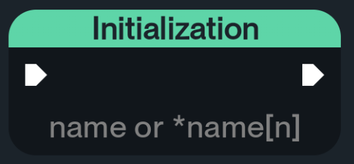
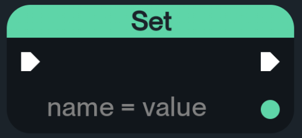
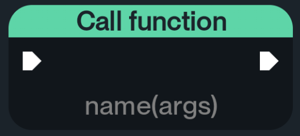
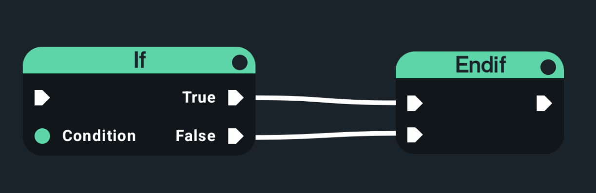
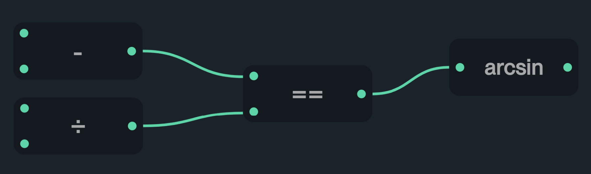

## Проект по разработке мобильных приложений
### Данный проект создан в рамках 7-го модуля обучения Высшей-IT Школы:

- [Янгель Юрием](https://github.com/rendivy)

- [Довыденко Гордеем](https://github.com/StaZisS)

- [Журавлёвым Максимом](https://github.com/kubavsop)

# Руководство пользователя
## Типы данных которые поддерживаются компилятором
<table>
    <tr>
        <th>Тип данных</th>
        <th>Как задать</th>
    </tr>
    <tr>
        <td>Array</td>
        <td>*name_array[size_array]</td>
    </tr>
    <tr>
        <td>String</td>
        <td>"your_string"</td>
    </tr>
    <tr>
        <td>Int</td>
        <td>123</td>
    </tr>
     <tr>
        <td>Double</td>
        <td>123.6</td>
    </tr>
     <tr>
        <td>Boolean</td>
        <td>true/false</td>
    </tr>
</table>

## Так же поддерживается приведение типов

<table>
    <tr>
        <th>Типы данных которые поддерживают приведение</th>
        <th>Метод</th>
        <th>Возвращаемый тип</th>
    </tr>
    <tr>
        <td>Boolean, Int, Double, String</td>
        <td>variable.toInt()</td>
        <td>Int</td>
    </tr>
    <tr>
        <td>Boolean, Int, Double, String</td>
        <td>variable.toDouble()</td>
        <td>Double</td>
    </tr>
    <tr>
        <td>Boolean, Int, Double, String, Array</td>
        <td>variable.toBool()</td>
        <td>Boolean</td>
    </tr>
    <tr>
        <td>Array</td>
        <td>variable.toString()</td>
        <td>String</td>
    </tr>
    <tr>
        <td>String</td>
        <td>variable.toList()</td>
        <td>Array</td>
    </tr>
   
</table>

## Функции которые поддерживаются компилятором

<table>
    <tr>
        <th>Функция</th>
        <th>Типы переменных поддерживаемые функцией</th>
        <th>Возвращаемый тип</th>
    </tr>
    <tr>
        <td>abs(variable)</td>
        <td>Int, Double</td>
        <td>Int, Double</td>
    </tr>
    <tr>
        <td>exp(variable)</td>
        <td>Int, Double</td>
        <td>Double</td>
    </tr>
    <tr>
        <td>ceil(variable)</td>
        <td>Int, Double</td>
        <td>Int</td>
    </tr>
    <tr>
        <td>floor(variable)</td>
        <td>Int, Double</td>
        <td>Int</td>
    </tr>
    <tr>
        <td>len(variable)</td>
        <td>Array, String</td>
        <td>Int</td>
    </tr>
    <tr>
        <td>sorted(variable)</td>
        <td>Array</td>
        <td>Array</td>
    </tr>
</table>

### Так же у Array есть метод .sort()

## Блоки

### Используется динамическая типизация данных поэтому при создании переменной ей необходимо указать значение блок Initialization.

### Чтобы изменить значение переменной необходимо импользовать блок Set.

### Для получения какого либо значения используется блок Get value.

### Если функция являяется void, т.е не возвращает значений, то её следует вызывать с помощью блока Call function.

### Блок Endif появляется вместе с создание блока If, он не обязателен, но он служет для ограничения области видимости.

### Работа с бинарными операторами происходит следующив образов, верхний оператор является левым, а нижний правым, т.е topPin operator bottomPin

#### Примечание
    - У блока логарифма верхний коннектор подлогорифмическое выражение, а нижний основание
    - У блока возведения в степень верхний коннектор число, а нижний степень

## Потоки данных

### Блоки используют потоки данных для комуникации между собой. Есть два потока данных так называемый основной поток и так же есть поток для переменных. Основной поток используется для определения приоритета.
